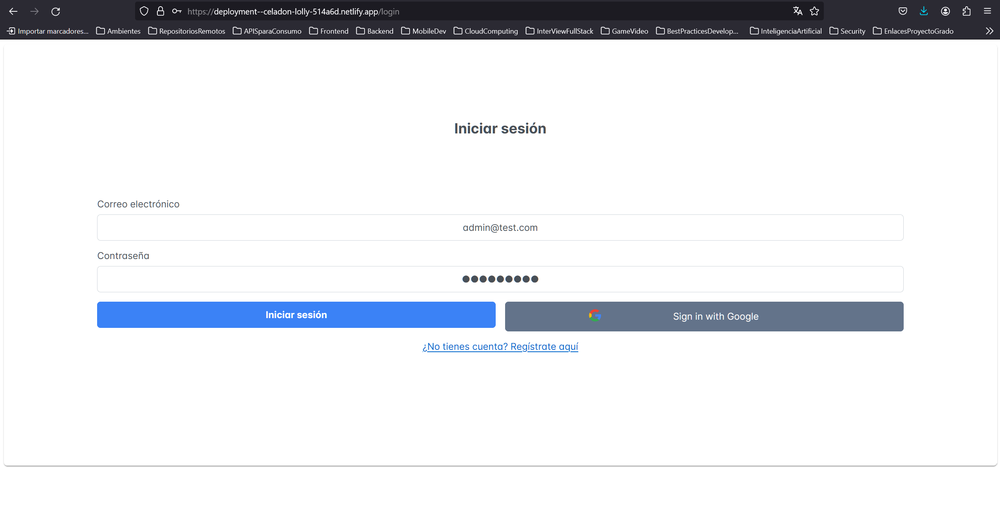

# Proyecto en Angular V.16 CLI
# Temática: Administración de Productos
## Estado del Proyecto: En Desarrollo.

Este repositorio contiene un proyecto práctico sobre Angular V.16, que permite efectuar acciones de tipo `CRUD`
sobre la información a manipular, el cual se divide en 3 ramas `main`, `develop` y `deployment`.

[//]: <> (Adicionalmente el proyecto cuenta con 2 ambientes, el de `Producción` y `Desarrollo`.)

## Estructura del Proyecto

La estructura del proyecto se diseño teniendo en consideración las mejores prácticas de organización de un proyecto Angular, quedando su estructura de la siguiente manera:
* src: contiene el código fuente de la aplicación.
* src/app: contiene los componentes, servicios, pipes, utilidades y directivas principales de la aplicación.
* src/app/core/services: contiene todos los servicios de la aplicación.
* src/app/core/interfaces: contiene todas las interfacez en la aplicación.
* src/app/core/guards: contiene todos los guardianes de rutas de la aplicación.
* src/app/shared: contiene todos los módulos de primeng encapsulados para mejor distribución de componenetes de estilos de la aplicación.
* src/app/features: contiene todos los módulos en la aplicación.
* src/app/features/xyz: contienen los componentes y otros elementos que conforman la aplicación.

## Tecnologías Utilizadas

Se utilizan las siguientes herramientas:
* HTML
* CSS
* JavaScript
* TypeScript
* Angular V.16
* PrimeNG V.16.9.1
* PrimeFlex V.3.3.1
* Primeicons V.7.0.0
* Firebase V.10.10.0
* Angular/fire V.16.0.0

## Ramas

### `main`

La rama `main` se utiliza solo para proporcionar información básica del repositorio,
en este caso el archivo `README`.

### `develop`

En la rama `develop` encontrarás el proyecto de Angular, el cual gestiona productos de una tienda. Incluye la creación de pantallas de inicio de sesión y registro, así como otras funcionalidades como la creación, edición y eliminación de productos en el inventario, entre otras.

Cabe mencionar que el proyecto ya tiene configurado 2 ambientes, correspondientes a `environment.ts`(si se despliega a producción tomaría este archivo) y `environment.development.ts`(al desplegarlo en modo desarrollo toma este archivo).
En estos archivos se encuentran las configuraciones de Firebase para su funcionamiento.

### `deployment`

En la rama `deployment` encontrarás el proyecto de Angular listo para llevar a producción.

## Instrucciones de Ejecución

### Rama Develop

Para poner en ejecución el proyecto de la presente rama se requieren los siguientes items:
* Git instalado para clonar el repositorio remoto en la máquina local.
* NodeJS instalado, para descargar las dependencias que utilice el proyecto definidas en el archivo package.json.

### Pasos para Poner en Ejecución la Aplicación

Ejecutar los siguientes comandos:
1. `git clone https://github.com/JuanCamiloDevFrontBack/my-shop-prueba-aux.git`.
2. `npm i` ó `npm install`.
4. Levantar la aplicación con: `npm run start`.
5. Abrir en el navegador la siguiente url: `http://localhost:7200/`.

### Rama Deployment

Para poner en ejecución el proyecto de la presente rama se requieren los siguientes items:
* Abrir el navegador web de su preferencia e ingresar al siguiente enlace web: `https://deployment--celadon-lolly-514a6d.netlify.app`.
